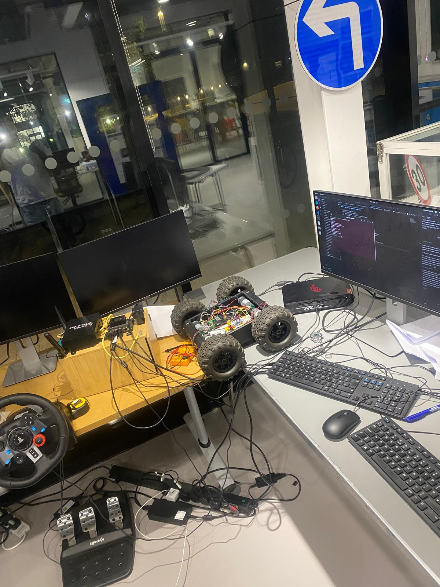

An embodied-AI project developing the infrastructure needed to train a vision-language-action model for instruction-guided off-road rover navigation. The current system connects human demonstrations, camera observations, wheel-encoder state, safety-constrained control, and episode recording in a modular ROS 2 pipeline.

## System

- Publishes natural-language tasks such as “Drive to the blue cone” through ROS 2.
- Converts Logitech G29 steering-wheel input sent over UDP into expert velocity commands.
- Applies speed limits, an emergency-stop input, and a stale-command watchdog before commands reach the motors.
- Calculates differential-drive odometry and VLA state from two Arduino-connected wheel encoders.
- Records synchronized camera frames, instructions, robot state, expert actions, and timestamps at 10 Hz.
- Provides fake odometry and a mock motor driver for software-only testing without actuating the rover.
- Includes an opt-in serial motor interface for deployment on the physical platform.

## Data Pipeline

Human teleoperation provides the expert action label, the rover camera supplies visual observations, and wheel encoders provide linear and angular state. Each recorded episode stores these signals alongside the task instruction in a raw, inspectable format designed for later conversion to a LeRobot dataset.

## Current Status

The ROS 2 package structure, safety filter, teleoperation adapter, encoder odometry, mock hardware path, and raw episode recorder are implemented. Hardware calibration, final LeRobot conversion, and SmolVLA fine-tuning remain in progress.

## Technologies

ROS 2 Humble, Python, OpenCV/cv_bridge, Arduino wheel encoders, Logitech G29 teleoperation, UDP and serial communication, NVIDIA Jetson, LeRobot, and SmolVLA.

[View the ROS 2 implementation and documentation on GitHub](https://github.com/Mayowa2024/VLA_ROVER)
