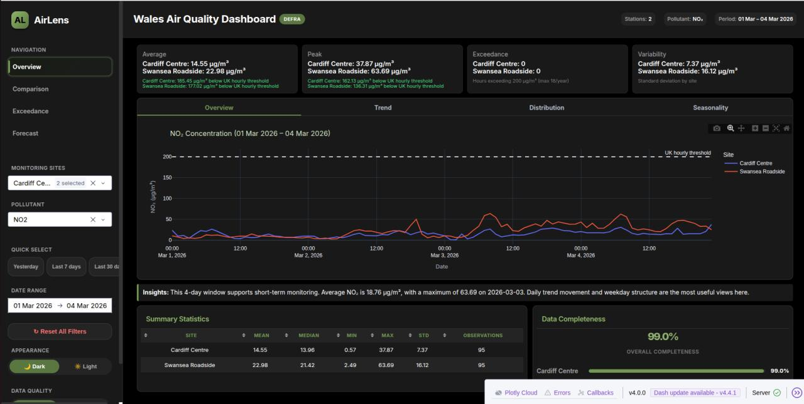
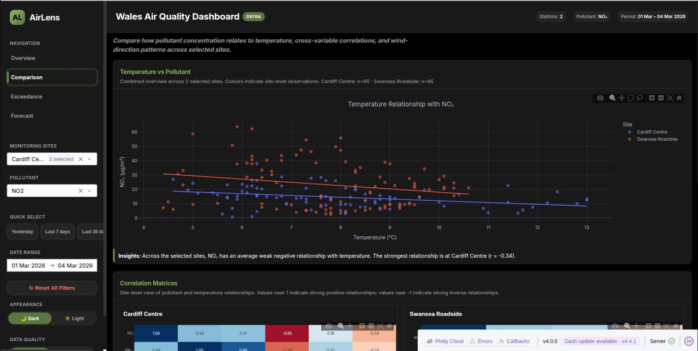

An interactive web application that turns historical air-quality measurements from Welsh monitoring sites into accessible visual analysis, regulatory exceedance checks, and seven-day forecasts. The dashboard covers NO₂, O₃, SO₂, PM10, and PM2.5 and is designed to help researchers, policymakers, and the public explore changes across sites and time periods.

## Dashboard

- Filters and compares multiple monitoring sites and pollutants.
- Explores daily, weekly, monthly, and seasonal trends with interactive Plotly charts.
- Reports summary statistics and data-completeness indicators.
- Compares measurements with UK and World Health Organization thresholds and counts exceedances.
- Visualises relationships through correlation heatmaps, temperature scatter plots, and pollution rose charts.
- Supports light and dark interface themes across dedicated overview, comparison, exceedance, and forecast pages.

## Forecasting

Separate XGBoost regression models generate seven-day concentration forecasts for each of the five pollutants. The feature pipeline combines pollutant lags and rolling statistics with weather conditions, site coordinates and type, weekend indicators, and cyclical calendar features. Weather forecasts are retrieved from Open-Meteo, with seasonal averages available as a fallback.

Predicted concentrations are converted to the UK Daily Air Quality Index scale. The dashboard then displays the expected AQI, identifies the dominant pollutant, and can use the Gemini API to translate the forecast into a short, plain-language explanation.

## Engineering

The application uses a modular, multi-page Dash architecture with reusable layouts, callbacks, data-loading utilities, forecast models, and Parquet datasets. Pytest coverage checks calculation, filtering, callback, and forecasting helpers, including missing-data and invalid-input behaviour.

## Technologies

Python, Dash, Plotly, Pandas, NumPy, XGBoost, Scikit-learn, Statsmodels, PyArrow, Open-Meteo, Google Gemini API, and Pytest.

[View the dashboard source code on GitHub](https://github.com/Mayowa2024/AirQualityDashboard)
