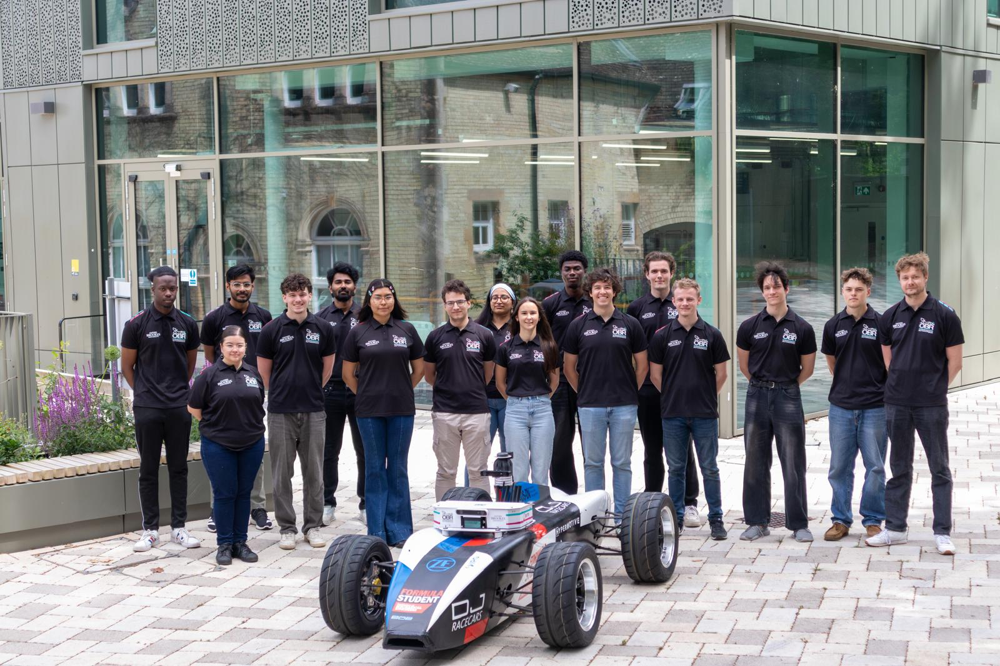
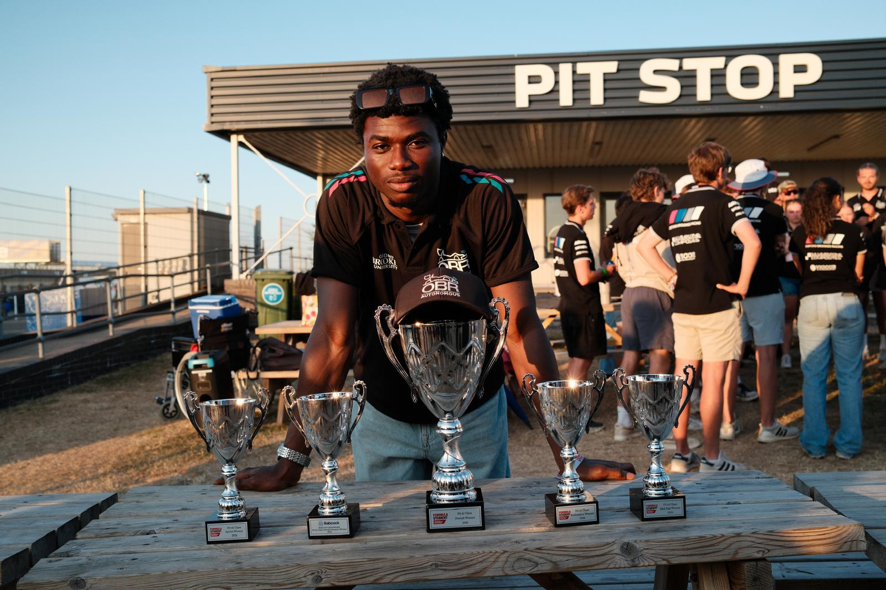
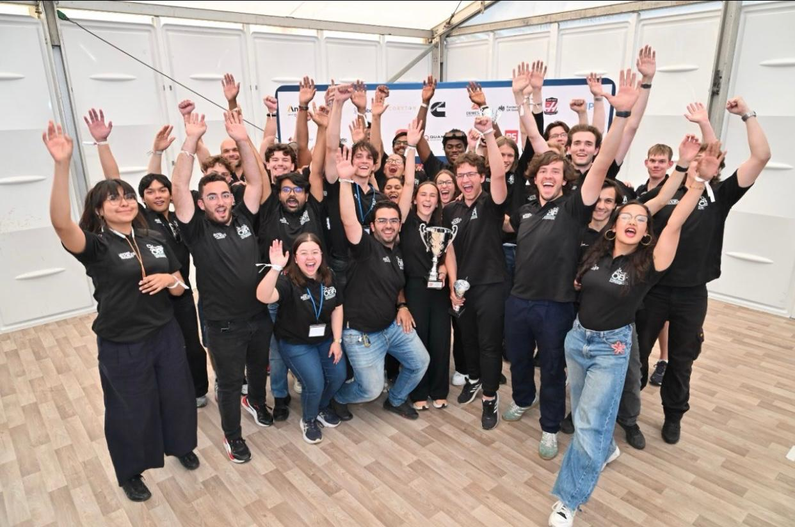
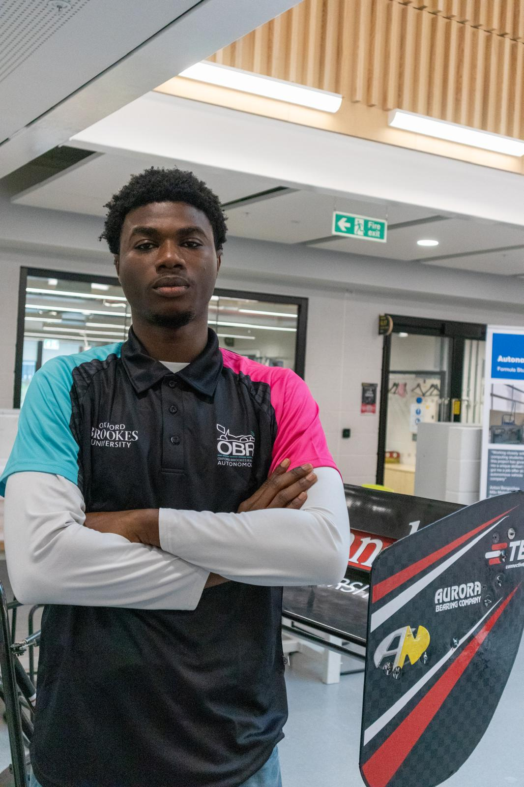

As part of our Formula Student AI team, I worked on the perception and autonomous systems behind our 1st-place overall finish at Formula Student AI UK 2026. The project combined real-time cone detection, embedded deployment, sensor integration, and track-side engineering for autonomous motorsport.

## Technical Contributions

- **Perception and edge-AI deployment:** Led the autonomous race-car perception pipeline, deploying YOLO-based cone detection on NVIDIA Jetson. Reduced inference latency from 284 ms per frame to 20 ms with FP16 and 14 ms with INT8—a 93–95% reduction that enabled real-time operation.
- **Localisation and mapping:** Contributed to the localisation pipeline by implementing Cubature Kalman Filter (CKF) fusion of wheel odometry and LiDAR pose estimates. Developed monocular cone localisation and evaluated camera–LiDAR fusion using regression and least-squares methods.
- **Vehicle control and functional safety:** Developed and debugged ESP-IDF/FreeRTOS vehicle control unit (VCU) software in embedded C, including CAN messaging, handshake logic, autonomous-state transitions, Autonomous System Status Indicator (ASSI) control, buzzer timing, and emergency-shutdown behaviour.
- **EV powertrain engineering:** Contributed to electric-vehicle powertrain design and integration through SolidWorks drivetrain components, reduction-system concepts, and simulation-led analysis.

This work required integrating perception, localisation, embedded control, safety systems, and vehicle hardware into a complete competition platform, then diagnosing and adapting the system under real track conditions.

## Achievements

- Won **1st overall at Formula Student AI UK 2026**.
- Competed in the inaugural Autonomous Platform Cup Car competition.
- Engineered and integrated our APC as a ground-up vehicle platform, bringing together the mechanical system, electronics, sensors, compute, and autonomous software stack.
- Achieved the first recorded vehicle movement in the competition's history.

## Competition Gallery

### Autonomous Run

Our APC autonomously moving during the inaugural Autonomous Platform Cup Car competition—the first recorded vehicle movement in the competition's history.

<video controls preload="metadata" width="100%">
  <source src="apc-autonomous-run.mp4" type="video/mp4">
  Your browser does not support embedded video. You can <a href="apc-autonomous-run.mp4">open the autonomous-run video directly</a>.
</video>

### Track Preparation

The team moving the APC into position before taking it onto the competition track.

<video controls preload="metadata" width="100%">
  <source src="apc-track-transport.mp4" type="video/mp4">
  Your browser does not support embedded video. You can <a href="apc-track-transport.mp4">open the track-preparation video directly</a>.
</video>
